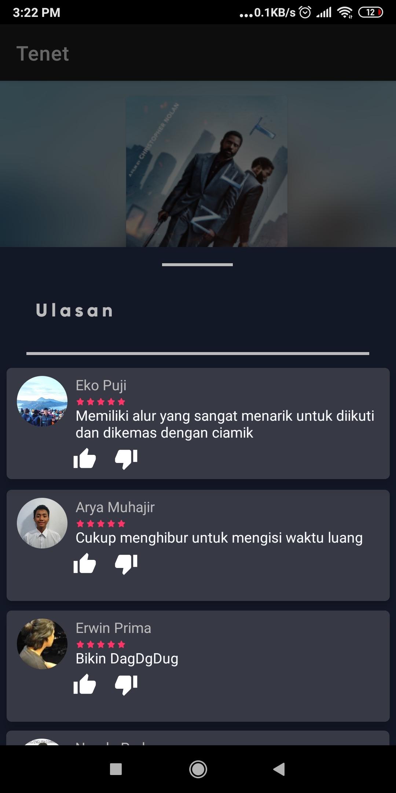

Ghibah Film Android
=================

A movies catalog android app.

Getting Started
---------------
This project uses the Gradle build system. To build this project, use the
`gradlew build` command or use "Import Project" in Android Studio.

Screenshots
-----------

 
 
 
 

 

 
 
 
 

 

 
  
 
 

  

 
 

Libraries Used
--------------

  * [AppCompat][1] - Degrade gracefully on older versions of Android.
  * [Android KTX][2] - Write more concise, idiomatic Kotlin code.
  * [Recyclerview][4] - Display large sets of data in your UI while minimizing memory usage.
  * [Navigation][14] - Handle everything needed for in-app navigation.
  * [BottomSheet][666] - Presents a dismissible view from the bottom of the screen.
  * [CircleImageView][667] - A fast circular ImageView perfect for profile images
  * [ViewPager2][668] - Display Views or Fragments in a swipeable format.
  * [CircleImageView][666] - A fast circular ImageView perfect for profile images
* Third party and miscellaneous libraries
  * [Glide][90] for image loading
  * [Kotlin Coroutines][91] for managing background threads with simplified code and reducing needs for callbacks

[1]: https://developer.android.com/topic/libraries/support-library/packages#v7-appcompat
[2]: https://developer.android.com/kotlin/ktx
[4]: https://developer.android.com/jetpack/androidx/releases/recyclerview
[14]: https://developer.android.com/topic/libraries/architecture/navigation/
[16]: https://developer.android.com/topic/libraries/architecture/room
[17]: https://developer.android.com/topic/libraries/architecture/viewmodel
[18]: https://developer.android.com/topic/libraries/architecture/workmanager
[30]: https://developer.android.com/guide/topics/ui
[90]: https://bumptech.github.io/glide/
[91]: https://kotlinlang.org/docs/reference/coroutines-overview.html
[93]: https://developer.android.com/training/dependency-injection
[666]: https://github.com/Flipboard/bottomsheet
[667]: https://github.com/hdodenhof/CircleImageView
[668]: https://developer.android.com/jetpack/androidx/releases/viewpager2
[669]: https://github.com/hdodenhof/CircleImageView

Non-Goals
---------
The focus of this project is on UI/UX implementation
